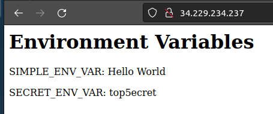
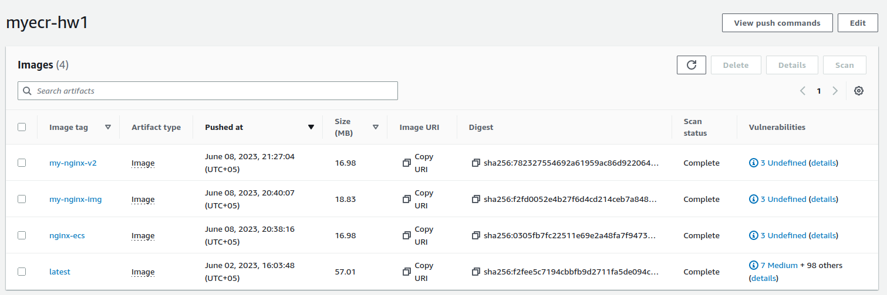
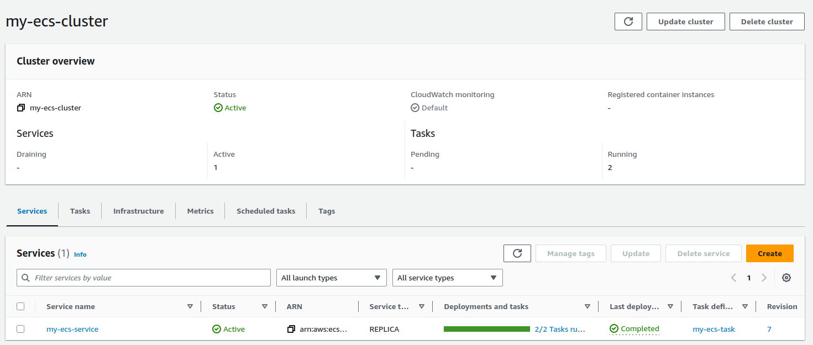
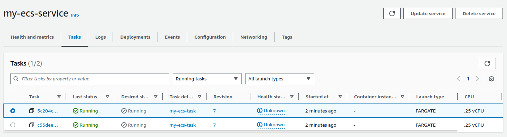
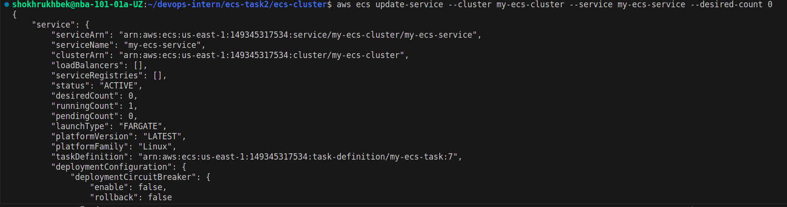
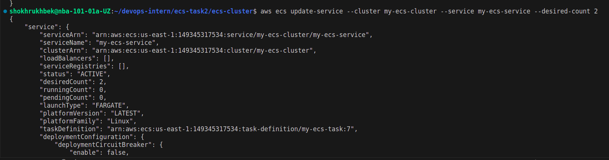

# ECS Cluster with Nginx

This repository contains code for setting up an ECS cluster with an Nginx web server using Terraform.

## Prerequisites

Before you begin, you'll need the following:

- An AWS account
- AWS CLI installed on your machine
- Terraform installed on your machine

## Getting Started

To get started, perform the following steps:

1. Clone this repository to your local machine.
2. Navigate to the root directory of the cloned repository.
3. Create a `terraform.tfvars` file and specify the values for the variables defined in `variables.tf`.
4. Create an AWS access key and secret key (if necessary) and store them in a `key.tfvars` file.
5. Initialize the Terraform environment by running `terraform init`.
6. Create an execution plan by running `terraform plan`.
7. Apply the changes by running `terraform apply`.

## Description of Files

- `provider.tf`: Specifies the AWS provider.
- `variables.tf`: Defines the variables used in the Terraform code, including the VPC CIDR block, availability zones, and application count for the ECS task definition.
- `vpc.tf`: Configures the network for the ECS cluster, including a main CIDR block with one public subnet, an internet gateway, and a route table.
- `ecs-sg.tf`: Defines the security group for incoming HTTP traffic to the ECS cluster.
- `key.tfvars`: Optional file containing the AWS access key and secret key.
- `autoscaling.tf`: Sets up an auto scaling group for the ECS service, which is controlled by average CPU usage with a target value of 60.
- `iam.tf`: Defines an IAM role for accessing the ECR repository and Secrets Manager.
- `main.tf`: Initializes the ECS cluster, service, and task definition.
- `aws_cli_commands.sh`: Contains an example AWS CLI command for scaling the ECS task to a desired count.
- `docker-nginx/`: Contains the Dockerfile for running Nginx with the specified environment variables.

## Screenshots

- 
- 
- 
- 
- 
- 
- 

## Scaling the ECS Task

To scale the ECS task to a desired count, you can use the AWS CLI. An example command is provided in the `aws_cli_commands.sh` file.

## Conclusion

This repository provides an example of how to set up an ECS cluster with an Nginx web server using Terraform and the AWS CLI. Feel free to modify the code to suit your specific use case.
